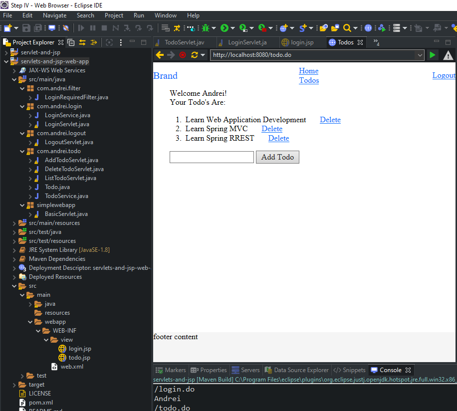

Learning Servlet and Jsp. Version 1.0   

Create and manage a To do list:   
Previews project: [servlets-and-jsp](https://github.com/FlorescuAndrei/servlets-and-jsp.git), with:
  - login,  
  - view Todo list,  
  - add Todo.

New in current project:
  - Add delete link;  
  - Add filter - prevent the user to directly access todo list via URL(http://localhost:8080/todo.do) and skip the login page;  
  - Add logout;  
  - Use Bootstrap.    
  
  
    
      
 
  
    
 [BACK TO START PAGE](https://github.com/FlorescuAndrei/Start.git) 
